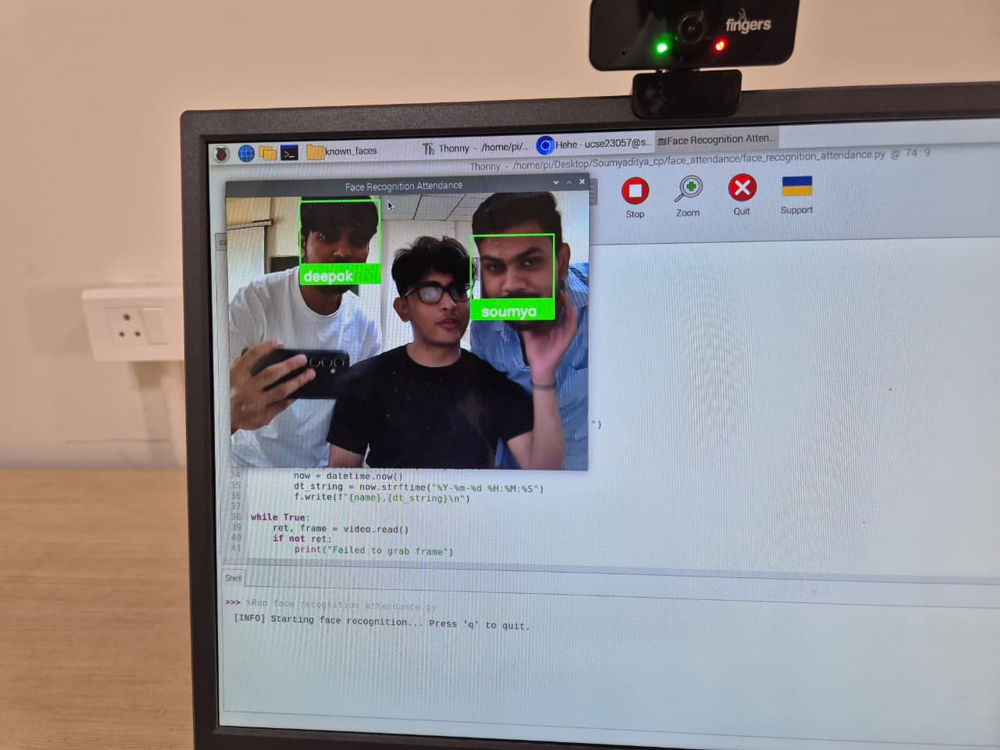

# Smart Attendance System using Face Recognition

This project implements a smart attendance system that uses face recognition
to automatically mark student attendance.

## Features
- Face registration using webcam
- Real-time face recognition
- Automatic IN and OUT attendance marking
- CSV-based attendance storage

## Technologies Used
- Python
- OpenCV
- face_recognition
- NumPy
- Pandas


## How to Run

### Step 1: Install dependencies
```bash
pip install opencv-python face_recognition numpy pandas

## 📸 Screenshots

### Face Enrollment


### Attendance Marking

